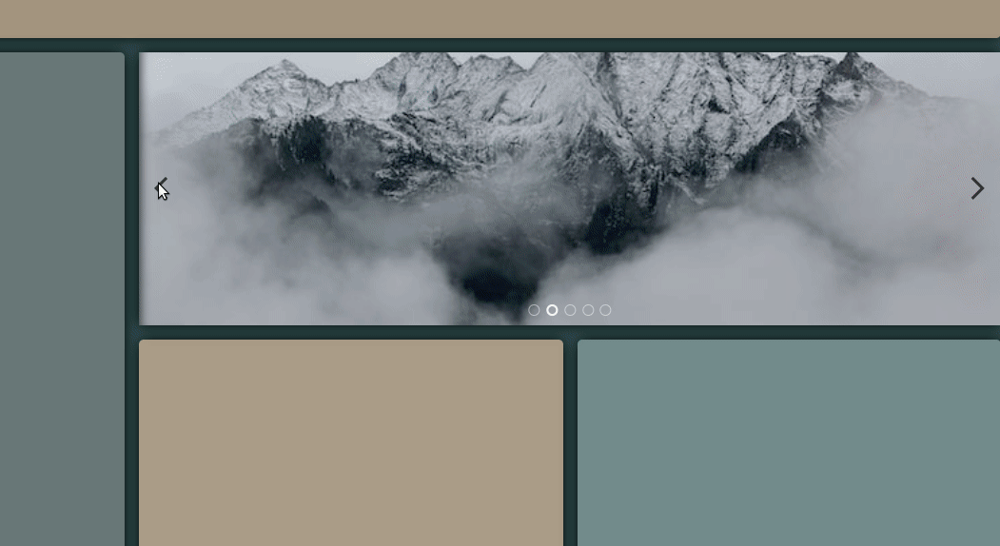

# img-slider-one

Generates an image slider panel with the given images.

### How to use it

First make sure your project has an HTML `<head>` tag, that is where the CSS will be appended with a `<style>` tag.

Then pass an array of urls along with a CSS selector for the parent

```ts

create(imageArray : string[], parentSelector : string)
```

Example

```ts
import createSlider from 'img-slider-one-ts'

// bla bla

createSlider([
    ./assets/image-one.jpg,
    ./assets/image-two.jpg,
    ./....
], '.hero > div.slider-wrap')
```

### Showcase


